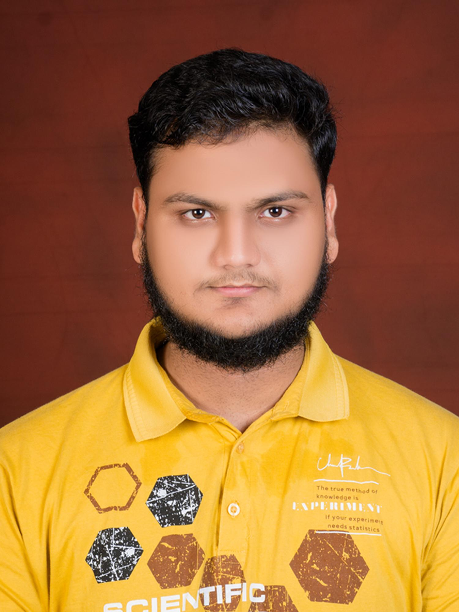

# Uzair Pathan — Digital Portfolio

### About Me
B.Tech Engineering Student at **SGGSIET (SGDS)** (Class of 2026).  
Specializing in **Electronics**, **Micro-controllers (Arduino)**, and **Technical Optimization**.

### My Certificates
This portfolio showcases my professional achievements and certifications:

- **Yuva AI For All** (NASSCOM FutureSkills Prime)
- **Engineering Chemistry** (MIT Vishwaprayag University)
- **Introduction to MATLAB Programming** (Vanderbilt University)
- **Engineering Physics Prerequisites**
- **Introduction to Modern AI**
- **Design Thinking Workshop**
- **SkillSpardha Technical Workshop**

### Key Projects
- **SGDS Parking Optimization** → A comprehensive POV and presentation on university bus parking.
- **Arduino Servo Integration** → Automated hardware control using logic gate feedback.
- **Computational Math** → Optimization solutions using Lagrange Multipliers.

### How to View
Visit the live portfolio here:  
👉 **[https://uzairpathan.github.io/Project-Aoi/](https://uzairpathan.github.io/Project-Aoi/)** *(Note: Ensure your GitHub username matches your link)*

### Files in Repository
- `index.html` → Main portfolio page (Dark Blue & Royal Blue Theme)
- `photo.jpg` → Profile photo
- `cert1.jpg` to `cert7.jpg` → Certificate images

---

Built with ❤️ by Uzair Pathan  
Made for showcasing technical excellence and academic milestones.
